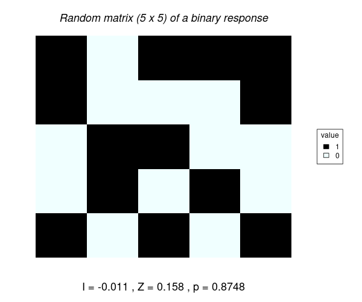

# Code used for analyzing spatial structure in the Ising model of criticality

Morans Index (I) estimates the spatial structure in the Data (i.e. how likely is to predict the value of an spatial observation with values of the neighbours arround the observation).

This index is calculated as the ratio of the number of observations (N) divided by the Weights (W) indicating whether an observation should be accounted for the calculation or not:

$$  <i>I = {N\over W} {A \over B} </i> $$

$$ <i>N</i> = samples $$

$$ W = {\sum_{i=1}^{N} w_{ij}} $$

$$ A = {\sum_{i=1}^N \sum_{j=1}^N w_{ij} z_i z_j } $$

$$ B = {\sum_{i=1}^{N} z_i²} $$

$$ z_i = x_i - \overline{x} $$

$$ z_j = x_j - \overline{x} $$


As suggested by <a href ="http://lctools.science/lctools/" target="_blank">Stamatis Kalogirou</a> we can define the weight matrix W as 1 minus the ratio between distance between a pair of observations divided by an arbitrary maximum distance (<i>H</i>); and values > <i>H</i> are considered as 0.

$$ (1-({dist_{ij} \over H})²)² $$

The distance between each pair of points ($dist_ij$) is calculated as the Manhatan distance: 

$$ |lat_i - lat_j| + |lon_i - lon_j| $$  


## Calculating the weight matrix. 

The value of Morans Index is sensitive to the weights matrix W that we assign in the calculations.

For a random 5 x 5 Matrix, we estimate the manhattan distance between each pair of observations: 
The result is a 25 x 25 matrix with weights for each pair of observations (ij).

<div align = "center">
 
</div>


<div align = "center">
   
</div>

</br></br>

<div>The weight matrix in lctools (with Bandwidth = 4) is represented by a matrix with zeros in the diagonal and in all pairs of observations (ij) separated by a distance larger that <i>H</i>.

<div align = "center">
  
</div>
</div>


## ISING MODEL DATA

<div align = "center">
  
</div>

```
  path2ising = "~/gaia/DATA/ising_grids/"
  fls = list.files(path2ising)
```

### Assigning the maximum distance between neighbors

The maximum distance between neighbours (H) defined to calculate the weights matrix (W), influences the value of I. As H increases I decreases. 

<div align = "center">
  
</div>

Legend of colors: Black (distance > H); proximity increases from cyan to purple (distance). 


### A method for Analizing a Large Matrix
Analyses of Distance, such as phylogenetics, networks, geographic; require analyzing a matrix of distances between elements (ij). This distance matrices can be large, and computers are often limited in their capacity of storing and handling data in RAM. For example, this limits are reached when analyzing an Ising model of 500 rows x 500 columns. In this matrix there are 250 000 elements, and the distance matrix required is 250 000 x 250 000. 

A normal function such as dist() would saturate computers memory. Hence large matrices must be analized element by element. Here is a code to do such task, calculating Moran´s Index.

```
# LIBRARIES
require(stringr)

# DATA.
# For this example, we can build a random matrix of 500 x 500 filled with 0s and 1s.
DATA = matrix(nrow=500, ncol=500, data=rbinom(size = 1, n = 250000, prob = 0.5))

# REDUCE THE MATRIX TO STRINGS

f.data = function(x){
       paste(D[,x], collapse='')}

D = sapply(1:nrow(DATA), f.data)

# D is a vector of 1 x 500, with strings with 500 caracters, either 0 or 1.

# An element in D can be found with the coordenates y(row) and x(column)
# For example, to finding the element in the coordinates y and x
y = 3 # row (latitude)
x = 2 # column (longitude)
  
xy = str_sub(D[y], x, x)

# There are 500 x 500 elements in the matrix D, and these can be found with a function f.yx.

f.yx = function(yx){
  y = yx[1]
  x = yx[2]
  str_sub(D[y], x, x)
}


# For the combinations of coordinates yx
yx = combn(1:500, 2) # Nota that these are coordinates of the half of the matrix. Pairs of elements are considered symetric ij = ji. Hence we just analyse the half of the combinations ij

# For further analyses we give a unique name to each element
colnames(yx)<-paste("ix", 1:ncol(yx), sep = "_")

# Lets call a pair of elements i,j from D
i = f.yx(yx[,1])
j = f.yx(yx[,2])

# Are they equal?
j == i
```

##### DEFINING THE WEIGHT MATRIX Wij of D
In the Moran index, only the pair of elements that are determined by the weight matrix are used to calculate the index. Thus we only need to find these elements.

```
# MANHATTAN DISTANCE
# HAY 500 x 500 elementos en la matriz D
# uno de esos 25000 elementos xy pueden encontrasrse con la funcion de f.yx

f.yx = function(yx){
  y = yx[1]
  x = yx[2]
  str_sub(D[y], x, x)
}

# FOR ALL ONE SIDE COMBINATIONS OUTSIDE THE DIAGONAL
# TO ADD DIAGONAL: yx_ = cbind(t(cbind(1:5, 1:5)), yx)

yx = combn(1:500, 2)
colnames(yx)<-paste("ix", 1:ncol(yx), sep = "_")

# DEFINE THE WEIGHT MATRIX W WITH MANHATTAN DISTANCE
# H is the maximum distance of the neighbors
H = 3

# Function for estimating the zi and zj values where wij is not 0.
# Multiplying wij*zi*zj will be 0 for all of them and they will not contribute to the sum in the numerator.
  
f0 = function(x){
  f.dif = function(x){
    yx[,-x]-yx[,x]
  }

  s = f.dif(x)
  
  n = ncol(s)
  a = NULL

  for(i in 1:n){
    a[i] = sum(abs(s[,i]))
    }
  yx[,colnames(s[,a<H])]
  }

# This will generate Y, a list with data for half of the elemtns off diagonal that are meaningfull (wij != 0).  
# The process can be partitioned with Y = lapply(1:100000, f0)

Y = lapply(1:(ncol(yx)-1), f0) 

f1 = function(x){
  b = NULL
  for(i in 1:ncol(Y[[x]])){
    b[i] = f.yx(Y[[x]][,i])
    }
  xi = as.numeric(f.yx(yx[,x]))
  zi = xi-0.5
  zj = as.numeric(b)-0.5
  zizj = zj * zi
  list(zizj, zi*zi)
}

Z = lapply(1:length(Y), f1)  

f.denom = function(x){Z[[x]][[2]]}
Zi = unlist(lapply(1:length(Z), f.denom))  

denom = sum(Zi*Zi)  

f.num = function(x){Z[[x]][[1]]}
WijZiZj = unlist(lapply(1:length(Z), f.num))

numer = sum(WijZiZj)

W = length(WijZiZj)  # assuming that weight is binay (either 1 or 0)
N = length(Z)

I = (N/W)*(numer/denom)  

I

```


### Graph results

```
M.T1 = M.T1.BISQ.1000
jpeg("ising_T1.5_10000neighbors.jpeg")
pal <- colorRampPalette(c("black", "azure"))
image(M.T1$W, col = pal(5))
title(main=c("p =", round(M.T1$p.value.randomization), 3))
dev.off()

jpeg("~/gaia/ising/weights.jpeg", quality = 100, height = 500, width=1500)
# svg("~/gaia/ising/weights.svg")

m = rbind(c(1,2,3))
layout(m)

image(as.matrix(T2.269), col = c(0,1))

TEMP = c(0:10)/10
colfunc <- colorRampPalette(c("black", "azure"))
mypal = as.numeric(cut(M.T2.BISQ.1000$W, TEMP))
image(M.T2.BISQ.1000$W, col=colfunc(length(TEMP))[mypal])

mypal = as.numeric(cut(M.T2.BISQ.9999$W, TEMP))
image(M.T2.BISQ.9999$W, col=colfunc(length(TEMP))[mypal])

dev.off()

```


