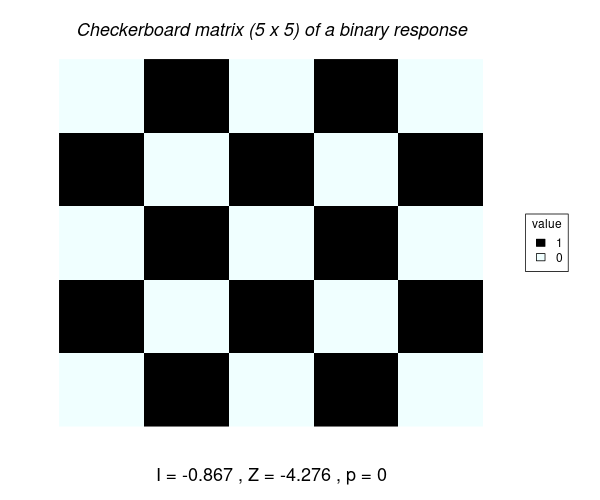

# Code used for analyzing spatial structure in the Ising model of criticality

Morans Index (I) estimates the spatial structure in the Data (i.e. how likely is to predict the value of an spatial observation with values of the neighbours arround the observation).

This index is calculated as the ratio of the number of observations (N) divided by the Weights (W) indicating whether an observation should be accounted for the calculation or not:

$$  <i>I = {N\over W} {A \over B} </i> $$

$$ <i>N</i> = samples $$

$$ W = {\sum_{i=1}^{N} w_{ij}} $$

$$ A = {\sum_{i=1}^N \sum_{j=1}^N w_{ij} z_i z_j } $$

$$ B = {\sum_{i=1}^{N} z_i²} $$

$$ z_i = x_i - \overline{x} $$

$$ z_j = x_j - \overline{x} $$


As suggested by <a href ="http://lctools.science/lctools/" target="_blank">Stamatis Kalogirou</a> we can define the weight matrix W as 1 minus the ratio between distance between a pair of observations divided by an arbitrary maximum distance (<i>H</i>); and values > <i>H</i> are considered as 0.

$$ (1-({dist_{ij} \over H})²)² $$

The distance between each pair of points ($dist_ij$) is calculated as the Manhatan distance: 

$$ |lat_i - lat_j| + |lon_i - lon_j| $$  


## Calculating the weight matrix. 

The value of Morans Index is sensitive to the weights matrix W that we assign in the calculations.

For a random 5 x 5 Matrix, we estimate the manhattan distance between each pair of observations: 
The result is a 25 x 25 matrix with weights for each pair of observations (ij).

<div align = "center">
 
</div>


<div align = "center">
  
</div>


## ISING MODEL DATA

<div align = "center">
  
</div>

```
  path2ising = "~/gaia/DATA/ising_grids/"
  fls = list.files(path2ising)
```

### Assigning the maximum distance between neighbors

The maximum distance between neighbours (H) defined to calculate the weights matrix (W), influences the value of I. As H increases I decreases. 

<div align = "center">
  
</div>

#### Weight matrices at different Bandwidths 

<div align = "center">
  
</div>

<div align = "center">
  
</div>

Legend of colors: Black (distance > H); proximity increases from cyan to purple (distance). 


### Check data set
```
readLines(paste(path2ising,fls[1], sep = ""), n=10)
T1.500 = read.table(paste(path2ising,fls[1], sep = ""),header=F, skip=1)
T2.269 = read.table(paste(path2ising,fls[2], sep = ""),header=F, skip=1)
T3.500 = read.table(paste(path2ising,fls[3], sep = ""),header=F, skip=1)

VT1 = c(as.matrix(T1.500))
VT2 = c(as.matrix(T2.269))
VT3 = c(as.matrix(T3.500))

lat.vt1 = rep(1:100, 100)
lon.vt1 = sort(rep(1:100, 100))

M.T1.BISQ = lctools::moransI(cbind(lon.vt1, lat.vt1), 8, VT1, WType ="Bi-square")
M.T1.BISQ.20 = lctools::moransI(cbind(lon.vt1, lat.vt1), 20, VT1, WType ="Bi-square")
M.T1.BISQ.50 = lctools::moransI(cbind(lon.vt1, lat.vt1), 50, VT1, WType ="Bi-square")
M.T1.BISQ.1000 = lctools::moransI(cbind(lon.vt1, lat.vt1), 1000, VT1, WType ="Bi-square")
M.T1.BISQ.9999 = lctools::moransI(cbind(lon.vt1, lat.vt1), 9999, VT1, WType ="Bi-square")

M.T2.BISQ = lctools::moransI(cbind(lon.vt1, lat.vt1), 1000, VT2, WType ="Bi-square")
M.T3.BISQ = lctools::moransI(cbind(lon.vt1, lat.vt1), 1000, VT3, WType ="Bi-square")
#saveRDS(list(M.T1.BINOM, M.T1.BISQ.50, M.T1.BISQ.1000, M.T1.BISQ.10000), "moran_T1.5.rds")
```


### Graph results

```
M.T1 = M.T1.BISQ.1000
jpeg("ising_T1.5_10000neighbors.jpeg")
pal <- colorRampPalette(c("black", "azure"))
image(M.T1$W, col = pal(5))
title(main=c("p =", round(M.T1$p.value.randomization), 3))
dev.off()

jpeg("~/gaia/ising/weights.jpeg", quality = 100, height = 500, width=1500)
# svg("~/gaia/ising/weights.svg")

m = rbind(c(1,2,3))
layout(m)

image(as.matrix(T2.269), col = c(0,1))

TEMP = c(0:10)/10
colfunc <- colorRampPalette(c("black", "azure"))
mypal = as.numeric(cut(M.T2.BISQ.1000$W, TEMP))
image(M.T2.BISQ.1000$W, col=colfunc(length(TEMP))[mypal])

mypal = as.numeric(cut(M.T2.BISQ.9999$W, TEMP))
image(M.T2.BISQ.9999$W, col=colfunc(length(TEMP))[mypal])

dev.off()

