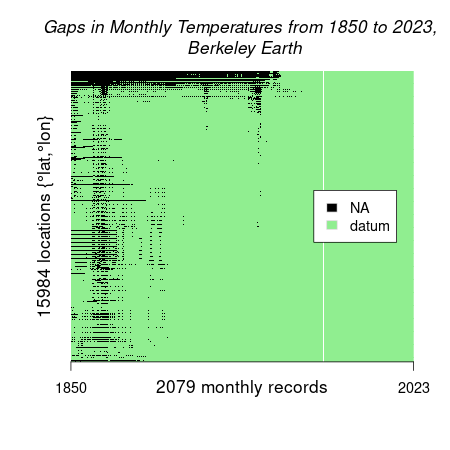
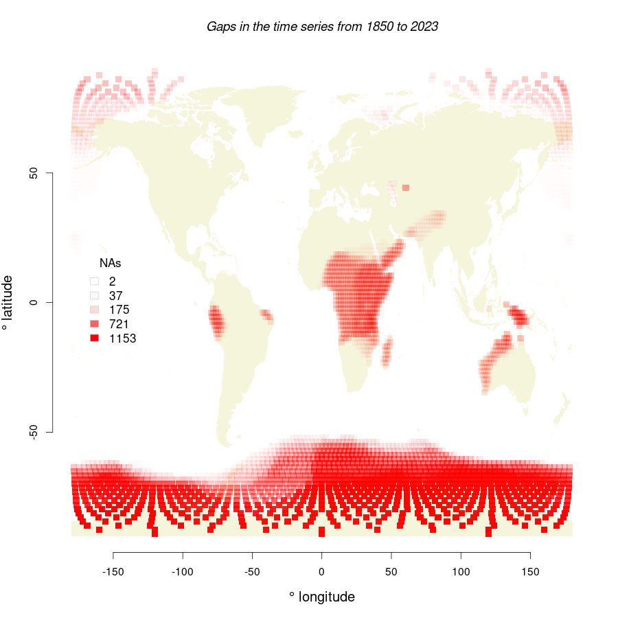
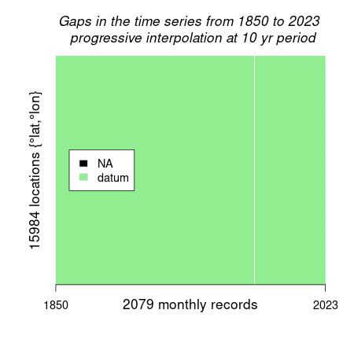
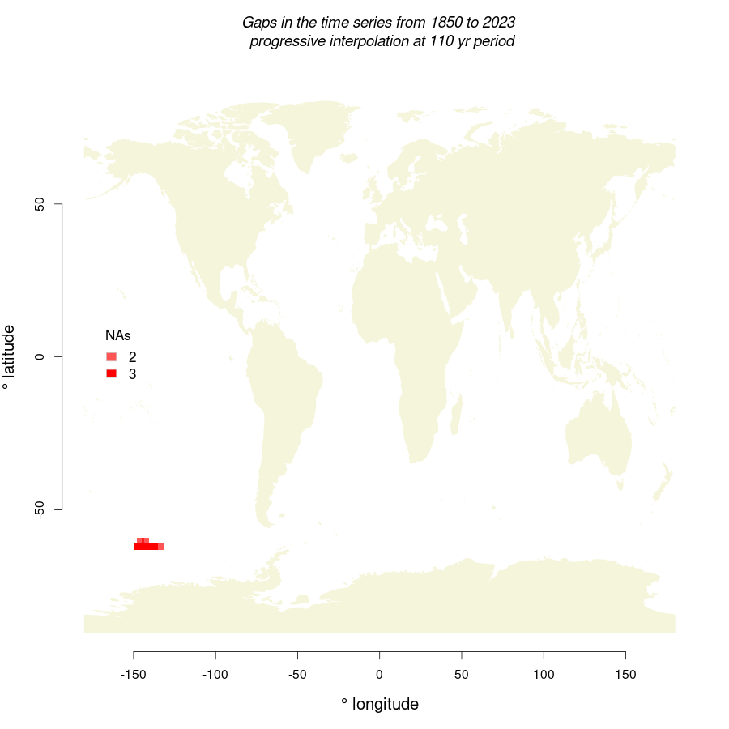

### Progressive Interpolation of Missing Data

Global time series are often incomplete, hence missing data must be infered before performing analyses like Principal Components and Singular Value Decomposition. Here, a progessive interpolation is implemented on the Global time series of air temperatures reported by Berkeley Earth (https://berkeleyearth.org/data/).

In the Berkeley database, 6.17 % of the data are missing, in particular recent data in large regions of Antartica and Africa (Figure 1). The progressive method was implemented in a progressive sequence of years: 2, 5, 10, 20, 40, 60, 80, 100, 110. With these iterations, the algorithm interpolated 72.5 % of the missing data, resulting in an interpolated database with 1.7 % of missing data concentrated in recent periods of Antartica (Figure 2).  

  <h4>Figure 1. Original dataset.</h2>
  

    
    
  

  <h4>Figure 2. Interpolated dataset.</h2>
  
    
    
  

##### (1) Read data from ncdf file, quantify and visualize missing data.
~~~
# R code
# R libraries
require(ncdf4)

# Path to Berkeley Earth data.
path2temp<-"/media/gegp/DATA/gaia/temperatures/Land_and_Ocean_EqualArea.nc"

nc <- nc_open(path2temp)
lon <- ncvar_get(nc, "longitude")
lat <- ncvar_get(nc, "latitude")
time <- ncvar_get(nc, "time")
tem <- ncvar_get(nc, "temperature")
climatology = ncvar_get(nc, "climatology")
nc_close(nc)

# Assign names to data, with month year.
month = rep (c("jan", "feb", "mar", "apr", "may", "jun", "jul", "ago", "sep", "oct", "nov", "dec"), 166)
year = sort(rep(1850:(1850+round(ncol(tem)/12, 0)), 12))
month.yr =  paste(month, year, sep="_")
colnames(tem) = month.yr[1:ncol(tem)]
row.names(tem) = paste(lon, lat, sep="_")

# Check how many data are missing (herein NA)  
y = table(is.na(tem))
y[1]/sum(y)

f.na = function(x){
  q = table(is.na(TEMP[,x]))
  false = q[1]
  true = q[2]
# CUANDO NO HAY VALOR (is.na = 0, o al reves), LA TABLA NO ES EXPLICITA, ASI ES QUE HAY QUE DEFINIRLO COMO 0!
#  true  = ifelse(is.na(true), 0, true)
#  false  = ifelse(is.na(false), 0, false)
  cbind(false, true)
}

TEMP = tem
nas = do.call(rbind, lapply(1: ncol(TEMP), f.na))
par(mai =c(1,1,1,1))
hist(nas[,2]) 

M = ifelse(is.na(TEMP), 1, 0)
png("~/gaia/figures/gaps_in_time_series.png", height=450, width=450)
image(M, col= c("lightgreen", 1), axes=F)
text(0.05,0.9, "1850", cex=1)
text(0.95,0.9, "2023", cex=1)
title(xlab=paste(ncol(M), "monthly records")
      , ylab= paste(nrow(M), "locations {°lat,°lon}"), line = 1
      , main = "Gaps in Monthly Temperatures from 1850 to 2023, \n Berkeley Earth", font.main=3)
legend("left", inset = 0.05, legend = c("NA", "datum"), fill = c("black", "lightgreen")
       , border="lightgrey")
dev.off()
 ~~~
##### Missing data in Berkeley Earth data.

  
  

#### Function for Progressive Interpolation

For a missing data, we infer its value as the average value (temperature anomaly) within a period of time, before and after the missing value.
Because the data are montly records of temperature, we estimated the average temperatures within the same months of the missing value, and did not consider temperatures of other months.

The above procedure was repeated on the database by gradually increasing the range of the time period to perform the interpolation. For example, first we interpolate data by considering the a timeperiod of 2 year before and after the missing value. Then, in the next irteration we increased the range period to 10 years before and 10 years after; and so on progressivley, until there are no more missing values.

The following function will perform the interpolation, based on a fixed value ventana, which corresponds to the number of years of the range period. For example, ventana = 2 means that the range period considered will be 2 year before and 2 years after the missing value. 

~~~
# INTERPOLATE TEMPERATURES

f.fill_2 = function(x){
  rowX = TEMP[x,]
  nas = is.na(rowX)
  ventana = ventana
  limite = ventana*12 + 1
  idx = limite:(length(rowX)-limite)
  seq = (c(-1*(2:1),(1:2))*12) # intervalos de tiempo para hacer el promedio con valores del mismo mes
  f1 = function(z){z+seq}
  seq.list = lapply(idx[nas], f1)
  
  f2 = function(q){ifelse(length(seq.list)==0, 0, mean(na.omit(rowX[seq.list[[q]]])))}
  Y = do.call(rbind, lapply(1:length(seq.list), f2))
  rowX[nas]<-Y
  rowX
  }

~~~

We implement the above function gradually as follows:
~~~
ventana = 2
Q_ = lapply(1:nrow(TEMP), f.fill_2)  
Z2 = do.call(rbind, Q_)

TEMP = Z2
ventana = 5
Q_ = lapply(1:nrow(TEMP), f.fill_2)  
Z5 = do.call(rbind, Q_)

TEMP = Z5
ventana = 10
Q_ = lapply(1:nrow(TEMP), f.fill_2)  
Z10 = do.call(rbind, Q_)

TEMP = Z10
ventana = 20
Q_ = lapply(1:nrow(TEMP), f.fill_2)  
Z20 = do.call(rbind, Q_)

TEMP = Z20
ventana = 40
Q_ = lapply(1:nrow(TEMP), f.fill_2)  
Z40 = do.call(rbind, Q_)

TEMP = Z40
ventana = 60
Q_ = lapply(1:nrow(TEMP), f.fill_2)  
Z60 = do.call(rbind, Q_)

TEMP = Z60
ventana = 80
Q_ = lapply(1:nrow(TEMP), f.fill_2)  
Z80 = do.call(rbind, Q_)

TEMP = Z80
ventana = 100
Q_ = lapply(1:nrow(TEMP), f.fill_2)  
Z100 = do.call(rbind, Q_)

TEMP = Z100
ventana = 110
Q_ = lapply(1:nrow(TEMP), f.fill_2)  
Z110 = do.call(rbind, Q_)

~~~

